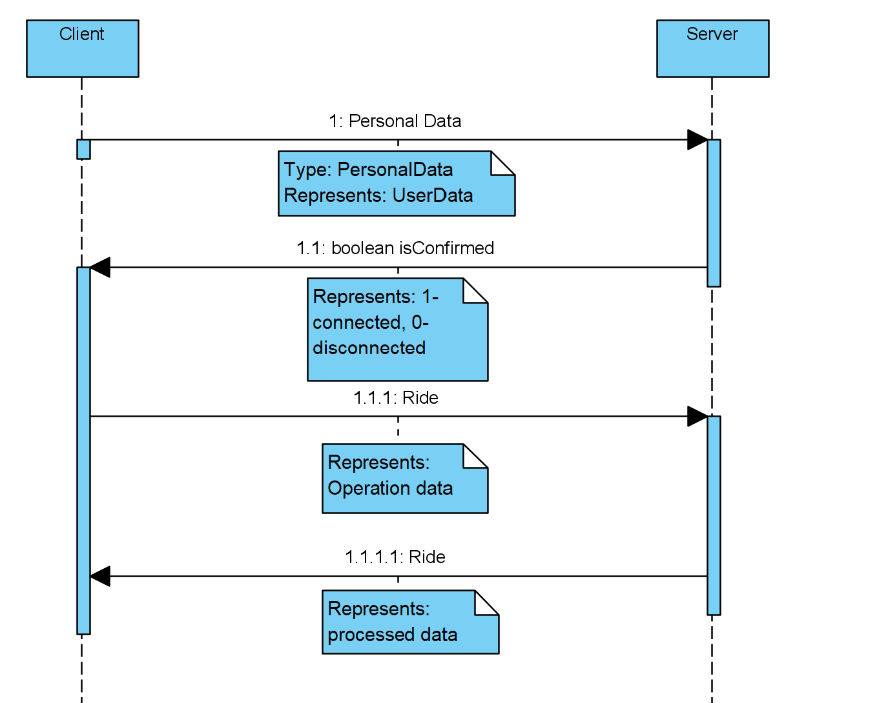

# Uber
Uber implementation- project for design patterns subject  
Contributers: https://github.com/rwidzisz and me   

Tech stack: Java, docker, linux, windows
Project includes: source code, documentation and UML diagrams

### Purpose
Implement idea choosen by a team, which we will improve using design and architectural patterns

### Manifest
Have 3-4 applications for client, driver, server and eventually database which will be working almost like uber in reallity. In future steps we may want to split options contained in server to microservises. All apps are build in one project. Except of design patterns we want to learn about ci/cd process- that's why we're using docker, building and our API. In the future we may want to add some regression testing 

##Building
Important note is that for now all apps have to be in locall network
#### a) without docerization
-Open project in IDE (InteliJ), set up Main class: Server (for server), ClientMobileApplication for client and so on...
-Set up IP address you want to connect with in program arguments, see correct set up below:

#### b) with dockeriztion
Building driver, server, client- on example of client
</ins>
-cd Uber/src/  
-docker build -t ubuntu_client --target client .  
-docker run -ti ubuntu_client  
<ins/>

##API documentation and description
#### Client-Server

